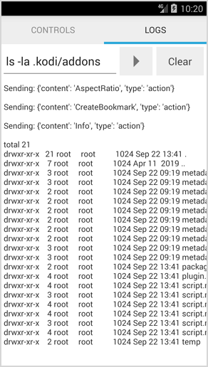

# KodiControl

Remote control for [**Kodi**](https://kodi.tv) and [**LibreELEC**](https://libreelec.tv) on a **Raspberry Pi**.

If you'd like to make a donation via **PayPal** or with a **Credit Card**:  

## Download

- [**releases**](https://github.com/mortalis13/KodiControl-Android/releases)

## How to use

- press **Settings** and fill in the `Host`, `User`, `Password`, `Port` and `System Type` (**Kodi** or **XBMC**), the values are saved when the dialog closes
- press **Connect** to establish a **SSH** connection with a **Raspberry Pi**
- use buttons to navigate the menu and control the playback
- use the **Text** field to type in the text when it's required (search dialogs, login info, etc.)
- in the **Logs** tab you can view the system response and execute remote system commands (like `ls`, `cat`, `df -h`, `kodi-send --action="Action(Stop)"`, etc.)

## Details

- the connection is performed using the **SSH** protocol and the [JSch](http://www.jcraft.com/jsch) library
- native **Kodi** commands are executed with the `kodi-send` command available in the **LibreELEC** distribution

## Screenshots

  
  
  
